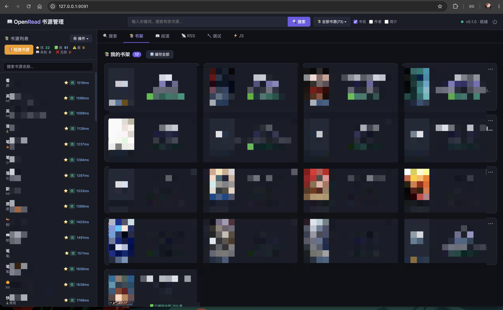

# AriaRead

📖 A cross-platform reading engine, focused on the open Chinese book-source ecosystem.

Built on [Aria](https://github.com/dqsjqian/Aria) (a C++23 reactive MVVM framework); compatible with mainstream book-source formats.

[English](README.en.md) | [简体中文](README.md)

## Screenshots

One C++ core drives two web shapes side by side:

| Shape | Screenshot | Notes |
|---|---|---|
| REST + SSE thin client |  | Browser talks straight to the C++ HTTP shell; Property changes stream out over SSE |
| SSR (server-side rendering) |  | Pages rendered on the C++ side; runs with zero JS on the frontend |

## Features

- **C++23 reactive MVVM** — built on the Aria framework: coroutine async, reactive state, ViewModels
- **Cross-platform engine** — CSS3/XPath selectors, a JS runtime bridge, Gumbo HTML5 parsing
- **Self-contained third-party deps** — nlohmann/json, OpenSSL, and libcurl all build from source; zero system dependencies
- **Extended ViewModel layer** — SearchViewModel, BookshelfViewModel, ReaderViewModel, SourceViewModel
- **Engine adapters** — engine_reader_adapter / engine_source_adapter keep engine.h's private dependencies isolated inside .cpp files
- **C++ web server** — Mira (in-house C++23 coroutine networking library) + Aria ViewModels: 39 REST routes, SSE push, zero Python

## Build

```bash
mkdir -p build && cd build
cmake .. -DARIAREAD_BUILD_TESTS=ON -DCMAKE_BUILD_TYPE=Release
cmake --build .
ctest --output-on-failure
```

## Running and distributing

Builds and distributions use the same `build/bin/` directory. Building the server also synchronizes its Web assets:

```bash
cmake --build build --target ariaread_web_server
./build/bin/ariaread_web_server

# The existing packaging command writes to the same directory
bash scripts/build_web_release.sh
```

`build/bin/` contains `ariaread_web_server`, the Aria libraries, and `web/`. Copy this directory as a unit to run elsewhere. Assets are loaded beside the executable by default; use `--web-root bindings/web/ariaread/web` explicitly for source-tree assets during development.

On Windows, use `scripts/build_web_release.ps1` and run `build/bin/ariaread_web_server.exe`. Multi-config generators use `build/bin/Release/` (or the selected configuration); pass `--config Debug` / `-Config Debug` to the scripts. `ARIAREAD_BUILD_DIR` selects another build directory.

The project no longer uses a `release/` directory; run and distribute the build output above.

## Project layout

```
AriaRead/
├── CMakeLists.txt          # C++23, unified options across platforms
├── include/                # public headers
│   └── ariaread/
│       └── version.h.in    # version template
├── src/                    # core engine sources
│   ├── engine/             # engine core
│   ├── selector/           # CSS/XPath selectors
│   ├── rule/               # rule analyzer
│   ├── infra/              # infrastructure (HTTP/JS/DB)
│   ├── viewmodels/         # ViewModel layer
│   └── apps/web_server/    # web server (Mira HTTP/1.1 + REST API)
├── tools/ci/
│   ├── build_ariaread_deps.py  # sole dependency source: pinned versions + SHA256
│   └── fetch_aria.py           # fetches Aria at a pinned commit -> build/deps/aria
├── bindings/web/ariaread/web/  # frontend static assets
└── tests/                  # unit tests
```

## Tests

Configure, build, and run the tests from the repository root:

```bash
cmake -S . -B build -DARIAREAD_BUILD_TESTS=ON -DCMAKE_BUILD_TYPE=Release
cmake --build build
ctest --test-dir build --output-on-failure
```

The main configure must pass `-DCMAKE_BUILD_TYPE=Release` explicitly: the deps
(Mira/OpenSSL/libcurl) are built with /MD, so an empty build type produces /MDd
objects and linking `ariaread_web_server` fails with LNK2038 runtime-library mismatch.

CTest registers engine tests and available ViewModel tests. It also registers the relevant debug regressions when Node.js 18+, Python 3.8+, and the Web Server target are available. CMake reports skipped optional dependencies; use `-DARIAREAD_BUILD_WEB_TESTS=OFF` to disable Web regressions.

```bash
# Run only the debug regressions
ctest --test-dir build -R ariaread-debug --output-on-failure

# Or run them directly; no npm or pip packages are needed
node tests/test_debug_ui.cjs
python3 tests/test_debug_http.py --server build/bin/ariaread_web_server
```

HTTP tests use local mock sources and an in-memory database to cover console validation and execution limits, successful and failed SSE stages, response limits including gzip decompression, and occupied-port protection. The server path can also be set with the `ARIAREAD_WEB_SERVER` environment variable. For another build directory or a multi-configuration generator, use the corresponding executable path.

## Release checklist

- [x] All sources compile from source (no prebuilt binaries)
- [x] No git submodules; all dependencies pinned and fetched by tools/ci scripts
- [x] MIT LICENSE
- [x] README.md (Chinese) + README.en.md (English)

## License

MIT License — see [LICENSE](LICENSE).
